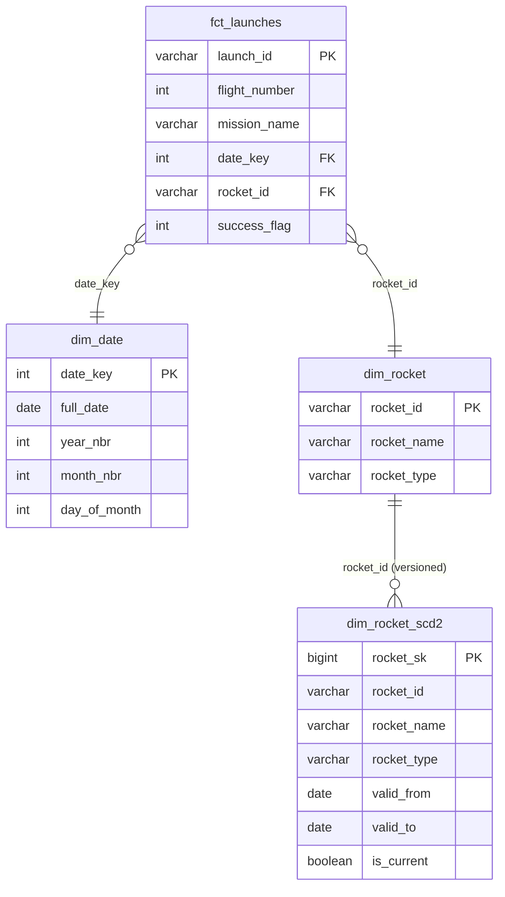

# Practical Data Modelling with DuckDB

[](https://github.com/kamikagome/space-x/actions/workflows/ci.yml)

A working example of **dimensional modeling** using SpaceX launch data. This repository demonstrates how to transform messy API data into a clean star schema for fast analytical queries. 

Learning project by Surfalytics data community: https://blog.surfalytics.com/p/practical-data-modelling-with-sql

---

## Project Overview

Raw data from the SpaceX public API is transformed through a **Bronze-Silver-Gold pipeline** into a dimensional model. The result: queries that actually return in under a second.

*This code was technically "written" by an AI while a human watched with a mix of awe and career-ending anxiety. Why write DDL manually when you can just describe your trauma to an LLM?*

## Architecture: Bronze → Silver → Gold

1. **Bronze:** Raw SpaceX API data (launches and rockets)
2. **Silver:** Cleaned staging table (`stg_launches`) with normalized columns
3. **Gold:** Star schema dimensional model ready for analysis

## The Model



**Fact Table:**
- `fct_launches` — One row per launch with metrics (success flag) and foreign keys

**Dimension Tables:**
- `dim_date` — Calendar dimension derived from launch dates
- `dim_rocket` — Rocket attributes (name, type)
- `dim_rocket_scd2` — SCD Type 2 variant showing dimension change history with validity periods

## Tech Stack

* **Database:** DuckDB (embedded, SQL-native)
* **Language:** SQL
* **Data Source:** SpaceX public API (community-maintained)

## Repository Structure

```
├── fetch_launches.sql      # Fetch API data → stg_launches
├── create_tables.sql       # Build star schema (dim/fact tables)
├── scd2.sql               # SCD Type 2 dimension example
├── sanity_checks.sql      # Validation queries & examples
├── spacex_modelling.duckdb # Database file
├── README.md              # This file
└── CLAUDE.md              # Development guide for Claude Code
```

## Quick Start

```bash
# Run full pipeline
duckdb spacex_modelling.duckdb < fetch_launches.sql
duckdb spacex_modelling.duckdb < create_tables.sql
duckdb spacex_modelling.duckdb < sanity_checks.sql

# Query the database
duckdb spacex_modelling.duckdb
# SELECT * FROM fct_launches JOIN dim_rocket ON ...
```

## Key Details

- **Data Sample:** Limited to 20 recent launches (remove `LIMIT 20` in `fetch_launches.sql` for full history)
- **Dependencies:** Each script depends on previous ones; run in order
- **Dimension Changes:** `scd2.sql` shows how to track rocket name changes over time with validity periods